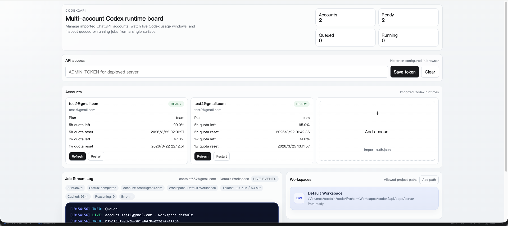

# codex2api

`codex2api` turns local Codex runtimes into a private multi-account API service with a small web dashboard.  
`codex2api` 可以把本地 Codex runtime 封装成一个私有的多账号 API 服务，并提供简洁的 Web 管理面板。



## 中文

### 简介

- 多个 Codex 账号统一管理
- 对外提供 OpenAI 风格接口
- 支持 `auth.json` 导入账号
- 支持图片输入与文件输入
- 支持查看 5 小时 / 1 周额度窗口
- 支持任务队列、任务日志、workspace 管理
- 支持 `data:` 图片、`file_data`、本地路径文件输入

### 启动

安装依赖：

```bash
npm install
```

启动后端：

```bash
npm run dev:server
```

启动前端：

```bash
npm run dev:web
```

构建：

```bash
npm run build
```

真实附件验证：

```bash
npm run verify:live
```

### 鉴权

如果设置了 `ADMIN_TOKEN`，除 `GET /healthz` 外，其它接口都需要：

```http
Authorization: Bearer <ADMIN_TOKEN>
```

前端面板已经支持输入这个 token，并会保存在浏览器 `localStorage` 中。

### 常用环境变量

```bash
PORT=3000
HOST=127.0.0.1
ADMIN_TOKEN=
CODEX_BIN=codex
CODEX2API_DATA_DIR=./data
DEFAULT_MODEL=gpt-5.4
DEFAULT_WORKSPACE_PATH=/absolute/path/to/workspace
WEB_ORIGIN=*
```

### 当前边界

- 默认是无状态接口，调用方自己管理上下文
- 每个账号同一时间只跑一个任务
- 每个 workspace 同一时间只允许一个写任务
- 支持文本、图片，以及文本/代码/PDF 文件输入
- `input_file.file_id` 暂不支持，需改用 `file_data`、`path` 或 `file_url`
- PDF 当前按文本型 PDF 处理，扫描件暂不保证可提取
- 任意二进制文件暂未全面支持

## English

### Overview

- Manage multiple Codex accounts in one place
- Expose an OpenAI-style API
- Import accounts from `auth.json`
- Support image input and file input
- Show both 5-hour and 1-week quota windows
- Provide job queue, job logs, and workspace management
- Support `data:` images, `file_data`, and local-path file input

### Run

Install dependencies:

```bash
npm install
```

Start the API server:

```bash
npm run dev:server
```

Start the web dashboard:

```bash
npm run dev:web
```

Build everything:

```bash
npm run build
```

Run the real attachment verification agent:

```bash
npm run verify:live
```

### Authentication

If `ADMIN_TOKEN` is set, every route except `GET /healthz` requires:

```http
Authorization: Bearer <ADMIN_TOKEN>
```

The dashboard includes a token input and stores it in browser `localStorage`.

### Common Environment Variables

```bash
PORT=3000
HOST=127.0.0.1
ADMIN_TOKEN=
CODEX_BIN=codex
CODEX2API_DATA_DIR=./data
DEFAULT_MODEL=gpt-5.4
DEFAULT_WORKSPACE_PATH=/absolute/path/to/workspace
WEB_ORIGIN=*
```

### Current Boundaries

- The external API is stateless by default
- One active job per account
- One active write job per workspace
- Supports text, images, and text/code/PDF file attachments
- `input_file.file_id` is not supported yet; use `file_data`, `path`, or `file_url`
- PDFs are handled as text-based PDFs for now; scanned PDFs are not guaranteed
- Arbitrary binary files are not fully supported yet
